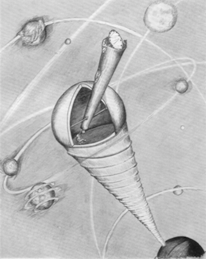

 
<h1>Umwelt</h1>
<em style="font-size: large; position: relative; top: -20px;"> Developing highly integrated remote-working research culture through a ladder of scientific communications</em> 

 
<em>Uexküll, Thure v.,</em> The Umwelt of an astronomer, 1934 

  

**Umwelt** (in ethology): the world as it is experienced by a particular organism. *"The worlds they perceive, their Umwelten, are all different."* The concept umwelt has special relevance for cognitive scientists, roboticists and cyberneticians.

 
 

  

