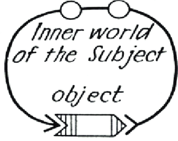
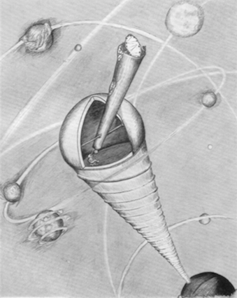

 

<h1>Umwelt</h1>

<ul>
  <li> <strong>Umwelt</strong>:
  <ul>
  <li> (in <a href="https://en.wikipedia.org/wiki/Ethology">ethology</a>) the world as it is experienced by a particular organism 
  <li> the natural virtual reality generated by the right hemisphere 
  <li> <em>The worlds they perceive, their Umwelten, are all different</em>
</ul>

<ul>
  <li> <strong>Agent</strong>:
  <ul>
  <li> the ego projection generated by the left hemisphere
</ul>
    
 

 
image: <em>Uexküll, Thure v.,</em> The Umwelt of an astronomer, 1934
 

    
Cognitive science shows us that our current systems of algorithmically-driven networked communications have trapped us in a false reality. 

Algorithmics has led to an emergent effect, where each action by each organisation driven by or exploiting a human cognitive bias (175 of which are currently identified) synergises with all similar such actions, completely enclosing human societies within a severaly distorted perceptual landscape. 

At network scale, this enclosure is splintering societies and crashing economies and institutions.

If we combine algorithmics with cognitive neuroscience, &#8216;The Matrix&#8217; (1999) is already metaphorically true:

Social media is an injection mechanism that roots your left hemisphere.

In McLuhan&#8217;s terms, social media both extends and amputates the left hemisphere. Our egos are now generated and projected by social media. This turns the search for eudaimonia and the True Self into a ponzi scheme, and engenders depression and suicidal ideation. 

Umwelt is a project to develop effective interventions into this situation: 

The first step is to recenter ego generation in the left hemisphere, free of influence by algorithmic propaganda. Key to this is training in negating egos. (Don&#8217;t worry - the left hemisphere will make more, that&#8217;s what it does.)

The next step is to shift the focus of our networked communications to the right hemisphere. If the left hemisphere generates egos, the right hemisphere generates the virtual realities into which these egos are projected.

These are Umwelts. 

Here, we develop ladders of scientific communications, including VR and AR, that shift the focus to the right hemisphere. 

Note that this is not a &#8216;VR&#8217; project. The VR, AR, and XR we are focused on are the ones generated inside your brain.

So far, Umwelt has hosted 3 events for international scientific communities, serving ~200 researchers in total.

    
  

